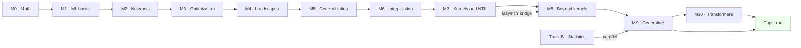

# Course map — modules, mastery, pacing

> 13 modules, 74 sessions, plus Track B (parallel seminar) and a 6–8 week capstone. Pace is **module-based, not hour-based**: pass the mastery criterion, then move on.

## Module flow

## Modules & mastery criteria

| Mod | Name | Sessions | Mastery criterion (must-pass) |
|---|---|---|---|
| M0 | Math, just enough | 1–4 | One-line Hoeffding proof + norm concentration in numpy |
| M1 | ML in 3 sentences | 5–8 | Bias-variance by hand + derive the min-norm solution |
| M2 | Networks from scratch | 9–14 | Hand-built 2-layer MLP + random-label experiment (Zhang 2017) |
| M3 | Optimization | 15–20 | GD/SGD/Adam curves + measured SGD noise covariance |
| M4 | Nonconvex landscapes | 21–26 | "Symmetry ⇒ saddles" proof + loss-landscape visualization |
| M5 | Rigorous generalization | 27–32 | VC of thresholds + a **vacuous** bound on a toy CNN |
| M6 | Interpolation mysteries | 33–40 | Benign/harmful phase diagram + hard-margin simulation |
| M7 | Kernels & NTK | 41–48 | Empirical NTK on MNIST + a reasoned "where NTK fails" answer |
| M8 | Beyond kernels | 49–56 | NC1–NC4 simplex reproduction + lazy→feature width sweep |
| M9 | Generative models | 57–68 | 2D diffusion + score-error rate test + "why OT is its language" |
| M10 | Transformers & scaling | 69–74 | Linear-transformer ICL reproduction + healthy skepticism on emergence |
| Track B | Advanced statistics seminar | B1–B6 | One 30-minute presentation, hand-built slides |
| Capstone | Team projects | 6–8 weeks | Reproduction + genuine research extension |

## Hard prerequisite chains (do not jump)

- SSBD/Mohri basics → M5 → M6 (interpolation needs rigorous generalization language)
- Kernels (M7, sessions 41–42) **before** NTK (43–44)
- NTK (M7) before lazy-vs-rich (47) and before neural collapse (M8)

## Per-module structure

Every module ends with a **student seminar session** — papers are assigned 2 weeks ahead and presented by the students (15–20 min + 10 min discussion each).