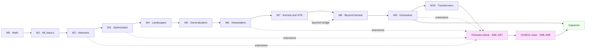

# Course map — modules, mastery, pacing

> 13 modules, **104 sessions** (1 foundation refresher S00 + 74 core + 9 extensions + 4 split pairs a/b + 14 Princeton-block S84–S97 + 2 COS511 S98–S99), plus a 6–8 week capstone. Pace is **module-based, not hour-based**: pass the mastery criterion, then move on.

## Module flow

## Modules & mastery criteria

| Mod | Name | Sessions | Mastery criterion (must-pass) |
|---|---|---|---|
| M0 | Foundations + math, just enough | S00–S04 | Expectation/variance + Chebyshev, then one-line Hoeffding proof + norm concentration |
| M1 | ML in 3 sentences (+ toolbox: trees, clustering) | 5–10 | Bias-variance by hand + derive the min-norm solution |
| M2 | Networks from scratch (+ GNN survey) | 11–17 | Hand-built 2-layer MLP + random-label experiment (Zhang 2017) |
| M3 | Optimization (+ large-scale tradeoffs) | 18–24 | GD/SGD/Adam curves + measured SGD noise covariance |
| M4 | Nonconvex landscapes | 25–30 | "Symmetry ⇒ saddles" proof + loss-landscape visualization |
| M5 | Rigorous generalization (+ multiclass, boosting, ranking) | 31–39 | VC of thresholds + a **vacuous** bound on a toy CNN |
| M6 | Interpolation mysteries | 40–47 | Benign/harmful phase diagram + hard-margin simulation |
| M7 | Kernels & NTK | 48–55 | Empirical NTK on MNIST + a reasoned "where NTK fails" answer |
| M8 | Beyond kernels | 56–63 | NC1–NC4 simplex reproduction + lazy→feature width sweep |
| M9 | Generative models | 64–75 | 2D diffusion + score-error rate test + "why OT is its language" |
| M10 | Transformers & scaling (+ attribution, RL) | 76–83 | Linear-transformer ICL reproduction + healthy skepticism on emergence |
| ⭐ Princeton block | S84–S97: approximation rates (84), tensors & topic models (85–86), adaptive optimization (87), overparam GD & linear-net dynamics (88–89), GAN theory (90), representation learning (91), LM & embeddings (92–93), adversarial attacks & certified defenses (94–95), no-spurious-minima (96), teaching/curriculum (97) | M2 ext: state Barron's O(1/n) bound · M3 ext: AdaGrad regret vs GD · M6 ext: explain width's role in zero-train-loss · M9 ext: birthday-paradox generalization test · frontier: PGD attack + convex-outer defense on a toy net |
| ⭐ COS511 track | S98–S99: multiplicative weights & EG (98), online log loss, shifting experts, portfolios, games (99) | Prove the Weighted Majority regret bound + run fixed-share vs Bayes on a shifted sequence |
| Capstone | Team projects | 6–8 weeks | Reproduction + genuine research extension |

## Course storyline

The sequence is one continuous argument, told in four acts:

1. **Act I — Build the machine (M0–M3).** Math that is *just enough* → what a learning machine is → build a network with your own hands → understand the optimizer that drives it. Session 14 plants the mystery that the course will resolve: *a network fits pure noise perfectly and still generalizes.*
2. **Act II — Why does it work? (M4–M6).** Nonconvex landscapes and why escaping them is easy in practice → the rigorous language of generalization (PAC, VC, Rademacher) → then the resolution of the mystery: double descent, benign overfitting, and implicit bias. Session 14's hook pays off in session 42.
3. **Act III — What does a trained network look like? (M7–M8).** The kernel regime: infinite width makes a network a linear, convex object (NTK) → then the turn: real networks exit the kernel regime, learn features, and collapse into a rigid simplex geometry (neural collapse).
4. **Act IV — Frontiers (M9–M10).** Generative modeling as score + optimal transport → transformers: in-context learning turns out to be gradient descent in disguise — closing the loop back to Act I. Then the **Princeton block (S84–S97)** harvests Arora's COS597 A/G/B reading lists — Barron's rates, tensor methods, adaptive optimization, GAN/embedding theory, adversarial robustness — and the **COS511 track (S98–S99)** adds the classical online-learning sequence (weighted majority → log loss → games). The new **S00 foundation refresher** prevents the course from rushing through Chapter 1 before S01. The 9 in-class extension sessions (E1–E13), the two added blocks, and 3 reading assignments complete every remaining chapter of every book at the point where its prerequisites exist.

## Hard prerequisite chains (do not jump)

- SSBD/Mohri basics → M5 → M6 (interpolation needs rigorous generalization language)
- Kernels (M7, sessions 48–49) **before** NTK (50–51)
- NTK (M7) before lazy-vs-rich (54) and before neural collapse (M8)

## Per-module structure

Every module ends with a **student seminar session** — papers are assigned 2 weeks ahead and presented by the students (15–20 min + 10 min discussion each).

## Seminars

Seminars (marked 🗣 in the [session sequence](session-sequence.html)) are **student-led sessions**: the presenter explains one paper — the problem, the main claim, the proof idea, and why it matters — pen-first, while the class asks questions and the instructor fills gaps only where needed. Several students present per session, so each module covers 3–6 papers beyond the lectures.

### How seminar papers were chosen

Seminar assignments were selected deliberately (not randomly from the literature), following five rules:

1. **Prerequisite guarantee** — a paper is assigned only after every tool it needs was built in earlier sessions. The sequence never jumps: e.g., Jacot (NTK) only after kernels & RKHS; Bartlett et al. 2020 (benign overfitting) only after PAC/Rademacher.
2. **Canonical and clean** — each paper is the originating or clearest statement of one course theme: expressivity → Cybenko · depth → Telgarsky · implicit bias → Soudry / Gunasekar · lazy-vs-rich → Woodworth / Chizat–Bach · collapse geometry → Lu–Steinerberger · score-estimation rates → Wibisono–Wu–Yang · in-context learning → von Oswald / Garg · induction heads → Olsson.
3. **Complementarity per module** — theory and experimental papers are paired (e.g., M2: Cybenko + Telgarsky + Zhang's random-label experiment; M6: Belkin/Hastie phenomena + Soudry/Gunasekar theory).
4. **Feasibility for beginners** — statements are self-contained, the required math was already built inside the course, and the experiments are reproducible on a laptop CPU. Genuinely hard statistical papers (gradient flows for empirical Bayes, learning GMMs via diffusion) are deliberately **not** seminar material — they live in the 🔬 research corner.
5. **Research payoff** — seminar papers feed the [research tracks](research-tracks.html): each one leaves an open question that capstone teams can attack (e.g., *why does SGD reach the simplex ETF?*, *score-estimation rates on manifold-supported data?*).